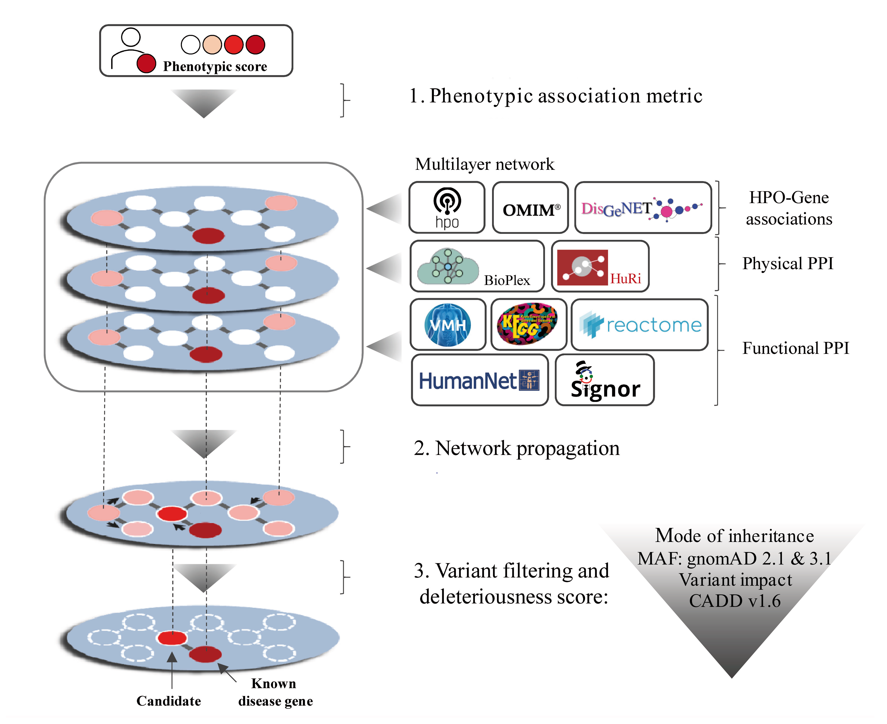
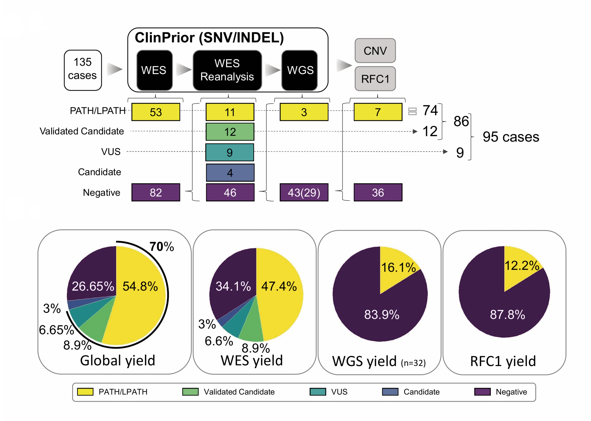

# ClinPrior

ClinPrior is an interactome-driven prioritization method that predicts the patient's disease causal variant  based on the description of the phenotype in HPO terms. This prioritization is divided into two steps: 

- **Gene prioritization:** computation of a phenotypic metric by comparing the patient's phenotype with HPO-Gene associations from existing human disease databases (prior knowledge) and iterative propagation of this phenotypic score within of a multilayer network with physical and functional interactions. 
- **Variant prioritization:** filtering and calculation of a variant deleteriousness score from WES or WGS sequences in a vcf (variant calling format) file. The last step returns a ranked list with the best variants that can explain the patient's phenotype at the top.

If you find this code useful in your clinical genomics analysis, please consider citing: [ClinPrior publication in Genome Medicine](https://genomemedicine.biomedcentral.com/articles/10.1186/s13073-023-01214-2)


### ClinPrior pipeline

<p align="justify"> First, the algorithm calculates the phenotypic association metric for each gene in the phenotypic layer based on the patient’s phenotype and known HPO-gene associations. The multilayer network is built from different data resources. The phenotypic layer reports HPO-gene associations, the physical layer reports physical protein‒protein interactions (PPIs) and the functional layer provides coexpression, signalling or metabolic pathway, and protein domain associations. The method propagates the phenotypic metric in adjacent nodes of the network so that higher scores indicate a better phenotypic fit with the patient. Variants resulting from patient genomic sequencing are filtered by frequency, variant impact and mode of inheritance. With this method, new candidate genes not previously associated with disease can also be identified thanks to the propagation of the phenotypic metric through neighbourhood connections.</p>


### Diagnostic yield in a patient real-world cohort

<p align="justify"> The diagnostic yield in WES and WGS in a real-world cohort with 135 families affected by hereditary spastic paraplegia (HSP) and/or cerebellar ataxia (CA).</p>

## Installation

You can install the development version from
[GitHub](https://github.com/) with:

``` r
install.packages("devtools")
devtools::install_github("aschluter/ClinPrior")
library(ClinPrior)
```

Download the human dataset for assembly GRCh38

``` r
dir.create(paste(system.file("extdata", package = "ClinPrior"),"/assembly38",sep=""))
library(piggyback)
pb_download(repo = "aschluter/ClinPrior",
            tag = "v2.0-assemblyGRCh38",
            dest = system.file("extdata/assembly38", package = "ClinPrior"))
            
            
if (!requireNamespace("BiocManager", quietly = TRUE))
    install.packages("BiocManager")

BiocManager::install("BSgenome.Hsapiens.UCSC.hg38")            
```


Download the human dataset for assembly GRCh37

``` r
dir.create(paste(system.file("extdata", package = "ClinPrior"),"/assembly37",sep=""))
library(piggyback)
pb_download(repo = "aschluter/ClinPrior",
            tag = "v2.0-assemblyGRCh37",
            dest = system.file("extdata/assembly37", package = "ClinPrior"))
            
            
if (!requireNamespace("BiocManager", quietly = TRUE))
    install.packages("BiocManager")

BiocManager::install("BSgenome.Hsapiens.UCSC.hg19")            
```


## Gene prioritization

Gene prioritization based on user-provided HPOs. 

| HP code | Description |
| --- | --- |
| HP:0004481 | Progressive macrocephaly |
| HP:0002376 | Developmental regression |
| HP:0001257 | Spasticity |
| HP:0001250 | Seizure |
| HP:0000238 | Hydrocephalus |
| HP:0002922 | Increased CSF protein |
| HP:0000365 | Hearing impairment |


``` r
HPOpatient = c("HP:0004481","HP:0002376","HP:0001257","HP:0001250","HP:0000238","HP:0002922","HP:0000365")

Y<-proteinScore(HPOpatient)
```


#### Score propagation

Propagation of the phenotypic score in the physical and functional interactomes. 

``` r
ClinPriorGeneScore<-MatrixPropagation(Y,alpha=0.2)

head(ClinPriorGeneScore)
```


| Symbol |	geneID |	PriorFunct |	Symbol	| geneID | PriorPhys |
| --- | --- | --- | --- | --- | --- |
| L2HGDH |	79944 |	0.75624798 |	L2HGDH |	79944 |	0.762632978 |
| SUMF1 |	285362 |	0.673091841 |	SUMF1 |	285362 |	0.6754931 |
| NDUFAF4 |	29078 |	0.587444509 |	ADGRG1 |	9289 |	0.672186086 |
| NDUFA1 |	4694 |	0.578958636 |	NDUFAF4 |	29078 |	0.60198354 |
| ADGRG1 |	9289 |	0.548488778 |	NDUFA1 |	4694 |	0.586792265 |
| ASPA |	443 |	0.513182187 |	ASPA |	443 |	0.529834244 |

The final result provides an ordered list of genes that match the patient's HPOs. The PriorFunct and PriorPhys columns report the phenotypic scores after propagation through the functional and physical gene-gene interactions of the network.


## Prioritization of genes from a file with the patient's HPOs

``` r
patientHPOsFile <- paste(system.file("extdata/example", package = "ClinPrior"),"HPOpatient.txt",sep="/")
HPOpatient <- unique(read.csv(patientHPOsFile, header = FALSE, sep = "\t")[, 1])
Y<-proteinScore(HPOpatient)
ClinPriorGeneScore<-MatrixPropagation(Y,alpha=0.2)

head(ClinPriorGeneScore)
``` 


| Symbol |	geneID |	PriorFunct |	Symbol	| geneID | PriorPhys |
| --- | --- | --- | --- | --- | --- |
| 14465 | KCNQ2 | 3785 | 0.75577235 | KCNQ2 | 3785 | 0.80781806 |
| 10110 | METTL23 | 124512 | 0.06526948 | METTL23 | 124512 | 0.07970679 |
| 6323  | KCNQ3 | 3786 | 0.06023326 | KCNQ3 | 3786 | 0.05990822 |
| 8082  | QDPR  | 5860 | 0.05522760 | QDPR  | 5860 | 0.05611487 |
| 7696  | SLC1A4  | 6509 | 0.04717662 | SLC1A4  | 6509 | 0.04898418 |
| 4269  | EDC3  | 80153 | 0.04607937  | EDC3  | 80153 | 0.04620877 |


## Variant prioritization


Once we have the gene prioritization result (ClinPriorGeneScore in the previous section) that best fits our patient's phenotype, we prioritize the patient variants from a WES or WGS annotated vcf file  with the Ensembl Variant Effect Predictor (VEP) (https://www.ensembl.org/info/docs/tools/vep/index.html). In the example below, we have created a synthetic vcf file with the pathogenic variant KCNQ2:Met546Thr.


``` r
library(vcfR)

#example for GRCh37 assembly
vcfFile = paste(system.file("extdata/example", package = "ClinPrior"),"HG001_GRCh37_1_22_v4.2.1_benchmark.vep01.KCNQ2Met546Thr.vcf.gz",sep="/")
variants <- read.vcfR(vcfFile)
variantsFiltered <- readVCF(sampleName = "HG001", variants=variants, assembly= "assembly37")
result = priorBestVariantVcfR(variants = variantsFiltered, sampleName = "HG001", GlobalPhenotypicScore = ClinPriorGeneScore, assembly= "assembly37")

head(result)
```


| ClinPriorPosition | CHROM | POS | REF | ALT | genesList | clinvar | knownDisease | Consequence | cDNA | Protein |
| --- | --- | --- | --- | --- | --- | --- | --- | --- | --- | --- |
|1 | 20 | 62044929 | A | G | KCNQ2 | pathogenic | AD | missense_variant | ENST00000359125.2:c.1637T>C | ENSP00000352035.2:p.Met546Thr |


The KCNQ2 Met546Thr variant is in the first row.


## VEP annotation

To annotate a vcf file, you will need the Ensembl Variant Effect Predictor (VEP) (https://www.ensembl.org/info/docs/tools/vep/index.html). This is the command line to annotate your vcf file using the VEP docker or command line tool. You will need to install VEP, CADD and MaxEntScan first.

``` r
vep --af --af_gnomade --af_gnomadg --appris --biotype --buffer_size 500 --cache --ccds --check_existing --database 0 --dir [PATH]/cache --dir_plugins [PATH]/VEP_plugins --distance 5000 --fasta_dir [PATH]/fasta --filter_common --force --fork 4 --hgvs --input_file [PATH]/vcf_test.vcf --mane --output_file [PATH]/output.vcf --pick_allele --polyphen b --pubmed --quiet --regulatory --safe --sift b --stats_text --symbol --transcript_version --tsl --var_synonyms --vcf
```

Alternatively, you can annotate your VCF using the VEP web interface. You should use the default checkboxes and additionally check the following: CCDS, Protein, HGVS, Variant synonyms, gnomAD (exomes) allele frequencies, gnomAD (genomes) allele frequencies, CADD, MaxEntScan, SpliceAI, Exclude common variants, and in Restrict results select "Show one selected consequence per variant allele".


## Docker

Docker allows running applications in virtualised containers. The ClinPrior Docker image is available from DockerHub: [ClinPrior in DockerHub](https://hub.docker.com/r/aschluterclinprior/clinprior)

After installing [Docker](https://docs.docker.com/get-started/), download the ClinPrior Docker image:

``` r
docker pull aschluterclinprior/clinprior:latest
```

To create and run a new container from the clinprior image:

``` r
sudo docker run -it clinprior bash
```

To run the clinprior application on HPC clusters download the singularity clinprior image. You will need to install the [singularity package](https://docs.sylabs.io/guides/4.2/user-guide/quick_start.html)

``` r
singularity pull --arch amd64 library://aschluter/clinprior/clinprior_latest:latest
```
