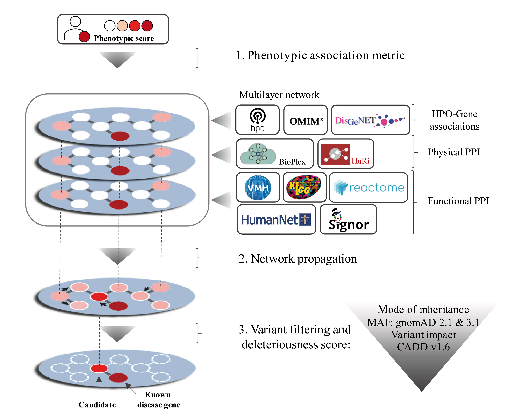
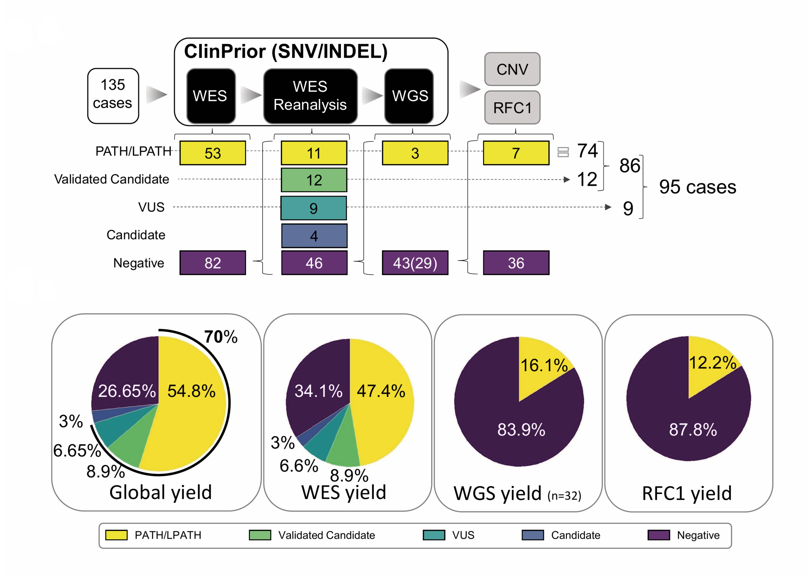

# ClinPrior

ClinPrior is an interactome-driven prioritization method that predicts the patient's disease causal variant based on the description of the phenotype in HPO terms. This prioritization is divided into two steps:

- **Gene prioritization:** computation of a phenotypic metric by comparing the patient's phenotype with HPO-Gene associations from existing human disease databases (prior knowledge) and iterative propagation of this phenotypic score within a multilayer network with physical and functional interactions.
- **Variant prioritization:** filtering and calculation of a variant deleteriousness score from WES or WGS sequences in a VCF (variant calling format) file annotated with VEP. Supports both **GRCh37 (hg19)** and **GRCh38 (hg38)** genome assemblies. The last step returns a ranked list with the best variants that can explain the patient's phenotype at the top.

If you find this code useful in your clinical genomics analysis, please cite:

> Schlüter A et al. (2023). ClinPrior: an algorithm for diagnosis and novel gene discovery by network-based prioritization. *Genome Medicine*, 15(1):68. [doi: 10.1186/s13073-023-01214-2](https://genomemedicine.biomedcentral.com/articles/10.1186/s13073-023-01214-2)

---

## ClinPrior pipeline

<p align="justify">First, the algorithm calculates the phenotypic association metric for each gene in the phenotypic layer based on the patient's phenotype and known HPO-gene associations. The multilayer network is built from different data resources. The phenotypic layer reports HPO-gene associations, the physical layer reports physical protein-protein interactions (PPIs) and the functional layer provides coexpression, signalling or metabolic pathway, and protein domain associations. The method propagates the phenotypic metric in adjacent nodes of the network so that higher scores indicate a better phenotypic fit with the patient. Variants resulting from patient genomic sequencing are filtered by frequency, variant impact and mode of inheritance. With this method, new candidate genes not previously associated with disease can also be identified thanks to the propagation of the phenotypic metric through neighbourhood connections.</p>

## Diagnostic yield in a real-world patient cohort

<p align="justify">Diagnostic yield in WES and WGS in a real-world cohort of 135 families affected by hereditary spastic paraplegia (HSP) and/or cerebellar ataxia (CA).</p>

---

## What's new in v4.0.0

- Full roxygen2 documentation for all functions
- New `splicingMode = "full"` with MaxEntScan parallel evaluation for intronic variants up to a user-defined distance from the exon boundary (`splicingDistance`)
- Standalone `MaxentScanClinPrior()` function for splice site evaluation on any variant matrix
- Physical phasing (CIS/TRANS) for compound heterozygous variants using GATK PGT/PID fields
- Internal cohort frequency filter via `freqInternaFile`: supports both Hail and standard TSV formats, bgzipped and tabix-indexed
- Hypervariable position filter for internal cohort frequency (STR/microsatellites) based on `nAllelesMax`
- New gnomAD 1 kb window constraint z-scores (`constraint_z_genome_1kb`) integrated in variant scoring (GRCh38 only)
- Unrecognized and removed HPO terms now reported in `proteinScore()` output (`$unrecognized_HPOs`, `$removed_HPOs`, `$used_HPOs`)
- Improved OMIM phenotype caching
- GPL-3 license
- Added `CITATION` file (Schlüter et al., *Genome Medicine* 2023)

---

## System requirements

The following external tools must be installed and available in your `PATH`:

- [bcftools](https://samtools.github.io/bcftools/) — required by `readVCF()`
- [Python](https://www.python.org/) + [maxentpy](https://github.com/kepbod/maxentpy) — required by `splicingMode = "full"` in `priorBestVariant()` and by `MaxentScanClinPrior()`
- [VEP](https://www.ensembl.org/info/docs/tools/vep/index.html) with plugins [CADD](https://cadd.gs.washington.edu/) and [MaxEntScan](http://hollywood.mit.edu/burgelab/maxent/Xmaxentscan_scoreseq.html) — the input VCF file must be pre-annotated with VEP before running ClinPrior (see [VEP annotation](#vep-annotation) section below)

---

## Installation
> **ClinPrior supports both WES and WGS data, and both GRCh37 (hg19) and GRCh38 (hg38) genome assemblies.**

```r
install.packages("devtools")
devtools::install_github("aschluter/ClinPrior")
library(ClinPrior)
```

---

## Usage

### 1. Gene prioritization

Provide the patient's HPO terms directly or from a file:

```r
HPOpatient <- c("HP:0004481", "HP:0002376", "HP:0001257", "HP:0001250",
                "HP:0000238", "HP:0002922", "HP:0000365")

result <- proteinScore(HPOpatient)
```

`proteinScore()` validates the HPO terms and reports:
- `result$scores` — numeric vector of gene scores to pass to `MatrixPropagation()`
- `result$used_HPOs` — HPO terms used for scoring
- `result$unrecognized_HPOs` — HPO terms not found in the database (check for typos or outdated HP codes)
- `result$removed_HPOs` — HPO terms excluded as too generic or non-informative

```r
result$unrecognized_HPOs
result$removed_HPOs
```

Alternatively, load HPOs from a file:
```r
patientHPOsFile <- paste(system.file("extdata/example", package = "ClinPrior"),
                         "HPOpatient.txt", sep = "/")
HPOpatient      <- unique(read.csv(patientHPOsFile, header = FALSE, sep = "\t")[, 1])
result          <- proteinScore(HPOpatient)
```

### 2. Score propagation

Propagate the phenotypic score across physical and functional gene interaction networks:

```r
GlobalPhenotypicScore <- MatrixPropagation(result$scores, alpha = 0.2)

head(GlobalPhenotypicScore)
```

| Symbol_Funct | geneID_Funct | PriorFunct | Symbol_Phys | geneID_Phys | PriorPhys |
| --- | --- | --- | --- | --- | --- |
| KCNQ2 | 3785 | 0.756 | KCNQ2 | 3785 | 0.808 |
| KCNQ3 | 3786 | 0.038 | KCNQ3 | 3786 | 0.037 |
| SCN8A | 6334 | 0.034 | SCN8A | 6334 | 0.037 |

`PriorFunct` and `PriorPhys` report the phenotypic scores after propagation through the functional and physical gene-gene interaction networks. Pass this object directly to `priorBestVariant()` as `GlobalPhenotypicScore`.

---

### 3. Variant prioritization

Read and filter a VEP-annotated VCF file:

```r
vcfFile  <- paste(system.file("extdata/example", package = "ClinPrior"),
                  "HG001_GRCh37_1_22_v4.2.1_benchmark.vep01.KCNQ2Met546Thr.vcf.gz",
                  sep = "/")

variants <- readVCF(sampleName         = "HG001",
                    vcfFile            = vcfFile,
                    assembly           = "assembly37",
                    geneQuality        = 20,
                    readDepth          = 10,
                    distSplicThreshold = "full",
                    synonymous         = TRUE)
```

Then prioritize variants:

```r
results <- priorBestVariant(
  variants              = variants,
  sampleName            = "HG001",
  GlobalPhenotypicScore = GlobalPhenotypicScore,
  assembly              = "assembly37",
  splicingMode          = "vep",
  discard_zero_score    = TRUE
)

head(results)
```

| ClinPriorPosition | CHROM | POS | REF | ALT | genesList | clinvar | knownDisease | Consequence | cDNA | Protein | ClinPriorScore |
| --- | --- | --- | --- | --- | --- | --- | --- | --- | --- | --- | --- |
| 1 | 20 | 62044929 | A | G | KCNQ2 | pathogenic | \|AD\| | missense_variant | ENST00000359125.2:c.1637T>C | ENSP00000352035.2:p.Met546Thr | 0.7597 |

To inspect filters and scores for a specific variant:
```r
attr(results, "traceVariant")("1", 62044929, "A", "G")
```

#### Splicing modes

`priorBestVariant()` supports two splicing evaluation strategies via `splicingMode`:

- `"vep"` (default) — uses MaxEntScan scores from the VEP annotation (canonical splice sites, ±30 bp boundary only)
- `"full"` — additionally calls `MaxentScanClinPrior()` for intronic variants within `splicingDistance` bp of the exon boundary (user-defined). Enables detection of deep intronic and cryptic splice sites. Requires Python + maxentpy.

```r
results <- priorBestVariant(
  variants              = variants,
  sampleName            = "HG001",
  GlobalPhenotypicScore = GlobalPhenotypicScore,
  assembly              = "assembly37",
  splicingMode          = "full",
  splicingDistance      = 1000,   # can be set to any distance in bp
  splicingWorkers       = 12
)
```

#### Internal cohort frequency filter

You can provide an internal cohort allele frequency file to filter out recurrent variants in your sequencing cohort. The file must be bgzipped and tabix-indexed.

Two column formats are supported and detected automatically:

**Format A — Hail output (alleles in a single column):**
```
chr     pos     alleles         AC   AN    AF            n_called
chr1    10144   ["TA","T"]      1    138   7.2464e-03    69
chr1    10146   ["AC","A"]      15   140   1.0714e-01    70
chr1    10327   ["T","C"]       2    138   1.4493e-02    69
```

**Format B — standard (REF and ALT in separate columns):**
```
chr     pos     REF   ALT   AC   AN    AF            n_called
chr1    10144   TA    T     1    138   7.2464e-03    69
chr1    10146   AC    A     15   140   1.0714e-01    70
chr1    10327   T     C     2    138   1.4493e-02    69
```

To index the file:
```bash
bgzip cohort_freq.tsv
tabix -s 1 -b 2 -e 2 cohort_freq.tsv.bgz
```

```r
results <- priorBestVariant(
  variants              = variants,
  sampleName            = "HG001",
  GlobalPhenotypicScore = GlobalPhenotypicScore,
  freqInternaFile       = "cohort_freq.tsv.bgz",
  freqInterna           = 0.4,
  nCalledMin            = 10,
  nAllelesMax           = 5
)
```

Key parameters:
- `freqInterna` — maximum allele frequency in the internal cohort (default `0.4`)
- `nCalledMin` — minimum number of called samples required to apply the filter (default `10`)
- `nAllelesMax` — maximum allele count allowed; also detects hypervariable positions (STR/microsatellites) where the same genomic position has more than `nAllelesMax` different alleles in the cohort (default `5`)

#### gnomAD 1 kb constraint z-scores (GRCh38 only)

When using `assembly = "assembly38"`, ClinPrior integrates gnomAD constraint z-scores computed in 1 kb genomic windows (`constraint_z_genome_1kb.qc.download.txt.gz`, included in the package). Variants in highly constrained regions receive a score bonus, providing additional evidence for pathogenicity independent of the variant consequence annotation.

> **Note:** the constraint file must be tabix-indexed before first use:
> ```bash
> tabix -s 1 -b 2 -e 3 -S 1 constraint_z_genome_1kb.qc.download.txt.gz
> ```

---

### 4. Standalone MaxEntScan analysis

`MaxentScanClinPrior()` can also be run independently on any set of variants to evaluate splice site strength changes. The input must be a `data.frame` with the following mandatory columns:

| Column | Type | Description |
| --- | --- | --- |
| `CHROM` | Character | Chromosome without `chr` prefix (e.g. `"1"`) |
| `POS` | Integer | Genomic position |
| `REF` | Character | Reference allele |
| `ALT` | Character | Alternative allele |
| `genesList` | Character | HGNC gene symbol |

```r
mx_input <- data.frame(
  CHROM     = c("1",     "2",     "17"),
  POS       = c(12345,   98765,   43210),
  REF       = c("A",     "GT",    "C"),
  ALT       = c("T",     "G",     "A"),
  genesList = c("GENE1", "GENE2", "BRCA1"),
  stringsAsFactors = FALSE
)

output <- MaxentScanClinPrior(
  matrixVariants = mx_input,
  assembly       = "assembly38",
  Threshold      = 0.2,
  workers        = 4
)
```

The output adds 8 columns to the input:

| Column | Description |
| --- | --- |
| `acceptor_loss` | Fractional loss of acceptor (3'ss) score (negative value) |
| `acceptor_loss_pos` | Genomic position of the affected acceptor site |
| `acceptor_gain` | Fractional gain of a new acceptor site |
| `acceptor_gain_pos` | Genomic position of the new acceptor site |
| `donor_loss` | Fractional loss of donor (5'ss) score (negative value) |
| `donor_loss_pos` | Genomic position of the affected donor site |
| `donor_gain` | Fractional gain of a new donor site |
| `donor_gain_pos` | Genomic position of the new donor site |

A value of `0` means no effect detected. For HPC/SLURM environments:
```r
library(BiocParallel)
output <- MaxentScanClinPrior(
  matrixVariants = mx_input,
  assembly       = "assembly38",
  BPPARAM        = BatchtoolsParam(workers = 20, cluster = "slurm",
                                   resources = list(memory = "8G",
                                                    walltime = "02:00:00"))
)
```

---

## VEP annotation

The input VCF file must be pre-annotated with the [Ensembl Variant Effect Predictor (VEP)](https://www.ensembl.org/info/docs/tools/vep/index.html) before running ClinPrior. Required plugins: CADD and MaxEntScan.

```bash
vep \
  --dir $HOME/vep_data \
  --fasta $HOME/vep_data/homo_sapiens/112_GRCh38/Homo_sapiens.GRCh38.dna.toplevel.fa.gz \
  --input_file [PATH]/input.vcf.gz \
  --output_file [PATH]/output.vep.vcf.gz \
  --compress_output gzip \
  --af --af_gnomade --af_gnomadg --appris --biotype \
  --buffer_size 10000 --cache --ccds --check_existing \
  --distance 5000 --filter_common --force --fork 12 \
  --hgvs --mane --no_stats --offline \
  --pick_allele --polyphen b --quiet \
  --regulatory --safe --sift b \
  --symbol --transcript_version --tsl --var_synonyms --vcf \
  --plugin CADD,snv=$HOME/vep_data/CADD/whole_genome_SNVs.tsv.gz \
  --plugin CADD,sv=$HOME/vep_data/CADD/gnomad.genomes.r4.0.indel.tsv.gz,force_annotate=1 \
  --plugin MaxEntScan,$HOME/vep_data/MaxEntScan/fordownload,SWA,NCSS
```

Alternatively, use the [VEP web interface](https://www.ensembl.org/info/docs/tools/vep/index.html) with the following additional options: CCDS, Protein, HGVS, Variant synonyms, gnomAD (exomes) allele frequencies, gnomAD (genomes) allele frequencies, CADD, MaxEntScan, Exclude common variants, and in Restrict results select "Show one selected consequence per variant allele".

---

## Docker

The ClinPrior Docker image is available on [GitHub Container Registry](https://github.com/aschluter/ClinPrior/pkgs/container/clinprior):

```bash
docker pull ghcr.io/aschluter/clinprior:latest
docker run -it ghcr.io/aschluter/clinprior:latest R
<<<<<<< HEAD
=======
```

To mount your local data directory inside the container:
```bash
docker run -it -v /path/to/your/data:/data ghcr.io/aschluter/clinprior:latest R
>>>>>>> affef3f (changes 09/03/2026)
```

For HPC clusters, create a Singularity image:
```bash
singularity pull docker://ghcr.io/aschluter/clinprior:latest
```

---

## License

GPL (>= 3)

## Citation

```r
citation("ClinPrior")
```